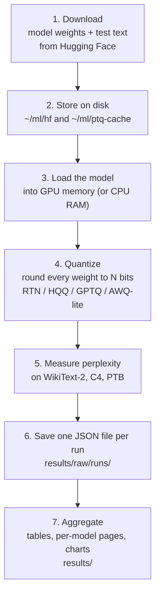

# How this program works

[docs/DESIGN.md](docs/DESIGN.md); for the numbers themselves, see
[results/README.md](results/README.md).

## The question

A language model is mostly a huge pile of numbers called **weights**. A 7-billion-weight
model stored at 16 bits per weight takes about 13 GB. Store each weight in 4 bits and it
takes about 3.5 GB, so it fits on a cheaper GPU and runs faster. But rounding every weight
to fewer bits damages the model.

This program measures **how much damage**, and **how much of it each clever rounding
method (quantization algorithm) can avoid**. It does that by giving the original model
and the rounded model the same reading test and comparing their scores.

## The whole journey in one picture



Each step is explained below, with where it happens in the code.

---

## Step 0: What you ask for

You tell the program what to measure, in one of three ways:

- **`uv run ptq`** opens a menu (the "wizard"): pick a model, dataset, method and bit width.
- **`uv run ptq eval --model facebook/opt-125m --algo gptq --bits 4`** measures one thing.
- **`uv run ptq run configs/experiments/resident_full.yaml`** measures a whole grid. The
  YAML file lists models, methods and bit widths, and the program runs every combination.
  `resident_full.yaml` alone is 5 models × 30 settings × 3 datasets = 450 runs.

Every combination becomes one **run**. Each run gets a short fingerprint (`run_id`, e.g.
`014ed667a8fe`) computed from its settings, so the same settings always get the same id.
That is how a crashed grid picks up where it left off: runs whose result file already
exists are skipped.

Code: `src/ptqbench/cli.py` (commands), `src/ptqbench/config.py` (settings and ids),
`src/ptqbench/runner/matrix.py` (walking the grid).

## Step 1: Downloading the weights and the test text

Nothing is bundled with the project. Everything comes from
[Hugging Face](https://huggingface.co), a public host for models and datasets, on first use:

- **Model weights**, e.g. `facebook/opt-125m` (0.25 GB) up to `meta-llama/Llama-3.1-8B`
  (16 GB). Each model's repo name, and a fallback mirror for gated models like Llama, is
  listed in `configs/models/<name>.yaml`. The program records the exact version (commit
  hash) downloaded, so results can be traced to the precise files.
- **Test text**: WikiText-2 (Wikipedia articles), C4 (web pages) and PTB (1980s Wall
  Street Journal sentences), the three datasets the research papers use.
- **Calibration text** (only for GPTQ and AWQ-lite): 128 random passages from C4's
  training split, which those methods study before rounding.

`uv run ptq prefetch configs/experiments/<name>.yaml` downloads everything an experiment
needs up front, which is useful before going offline or queueing a cluster job.

## Step 2: Where things are stored

Big files stay **outside** the project folder, so git never sees them. The default root is
`~/ml` on a laptop, or `$SCRATCH` on a cluster; `source scripts/env.sh` sets it up.

| what | where | size |
|---|---|---|
| Downloaded model weights | `~/ml/hf/` (Hugging Face's own cache layout; override with `HF_HOME`) | 0.25–16 GB per model |
| Downloaded datasets | `~/ml/hf/` and `~/ml/ptq-cache/datasets/` | ~2 GB total |
| Test text already split into tokens | `~/ml/ptq-cache/tokenized/` | small |
| Calibration passages | `~/ml/ptq-cache/calib/*.pt` | small |
| Already-quantized weights (GPTQ/AWQ only) | `~/ml/ptq-cache/quant/<quant_key>.safetensors` | up to GBs each |
| **Results** | **`results/` inside the project** | tiny JSON files |

Why keep quantized weights? GPTQ on a 7B model can take one to two hours. If the run
crashes between datasets, the next attempt loads the finished weights from this cache
instead of redoing the work. `uv run ptq cache ls` shows it and `ptq cache gc --max-gb N`
trims it. The program warns once the cache passes 50 GB.

`uv run ptq env-check` prints every one of these locations for your machine.

Code: `src/ptqbench/paths.py`, the single place every location is defined.

## Step 3: Loading the model

The weights are read from the download cache into memory as 16-bit numbers (fp16, or
bf16 for Llama-3.1). Where they go depends on whether they fit:

- **Resident**: the model fits on the GPU (with 30% room to spare), so the whole thing
  goes there. This is the fast path, used for models up to ~2.7B weights on an 8 GB card.
- **Streamed**: the model does not fit. The weights stay in ordinary RAM and are sent to
  the GPU **one layer at a time**. A language model is a stack of identical layers (32
  for Llama-2-7B), and the text flows through them in order. So the program pushes a
  batch of text through layer 1, swaps in layer 2, pushes it through, and so on. The
  arithmetic is identical; only the order changes. This is how a 13 GB model was measured
  on an 8 GB GPU using under 2 GB of it.

The choice is automatic. If a resident attempt runs out of GPU memory anyway, the run
retries streamed before giving up.

Code: `src/ptqbench/runner/execute.py` (`prepare`, `choose_eval_mode`),
`src/ptqbench/eval/streaming.py` (layer-at-a-time machinery), `src/ptqbench/device.py`.

## Step 4: Quantizing (the part being studied)

Quantizing means replacing every weight with the nearest value on a coarse grid. With
4 bits there are only 2⁴ = 16 allowed values; with 2 bits, just 4.

**The grid.** For each row of a weight matrix (or each group of 128 or 64 weights, the
"group size"), the program finds the smallest and largest weight, and spreads the allowed
values evenly between them. A tiny 2-bit example with four weights:

```
original:   0.12   -0.40    0.33    0.05
grid (4 values, from -0.40 to 0.33):  -0.49  -0.24   0.00   0.24
rounded:    0.00   -0.49    0.24    0.00
```

Every weight moved, and two of them collapsed to zero. Across billions of weights, that
error adds up. Smaller groups give each group its own tighter grid, which is why
"groups of 128" beats "per row" in almost every table.

**Fake quantization.** The program rounds each weight to the grid and immediately
converts it back to a normal 16-bit number. The model then runs exactly as before, but
every weight now sits on the coarse grid. This measures the *accuracy* effect of 4-bit
storage without needing special 4-bit GPU code, and it is how the published papers
measured it too. The weights on disk are never modified; all of this happens in memory.

**The four methods** differ in *how* they choose the rounded values:

| method | needs sample text? | idea |
|---|---|---|
| **RTN** | no | Round each weight to the nearest grid point. Fast and simple; the baseline. |
| **HQQ** | no | Search for a better grid offset than plain min/max, using the weights alone. |
| **GPTQ** | yes, 128 passages | Round weights one column at a time; after each, adjust the not-yet-rounded weights to cancel the error just introduced, using statistics of how the sample text actually flows through that layer. |
| **AWQ-lite** | yes | Find which inputs to each layer carry the most signal, scale the weights so those inputs lose the least precision, then round like RTN. |

GPTQ and AWQ-lite process the model layer by layer, feeding the calibration text through
each layer before quantizing it, which reuses the same streaming machinery as Step 3.

Code: `src/ptqbench/quantizers/` — `fakequant.py` (the grid, shared by all methods),
`rtn.py`, `hqq_adapter.py`, `gptq.py`, `awq_lite.py`.

## Step 5: Measuring perplexity

This is the reading test. The test text is split into tokens (word pieces) and cut into
windows of 2048 tokens. WikiText-2 gives about 140 windows for OPT models.

For each window, the model reads the text and, at every position, predicts the next
token. We look at the probability it gave to the token that *actually* came next:

- confident and right (probability 0.9): small penalty
- unsure (probability 0.01): large penalty

The penalty is the negative logarithm of that probability. Average it over every token
in every window, then take `e` to the power of that average. The result is
**perplexity**: roughly, "how many words was the model torn between, on average?"
Lower is better. opt-125m scores 27.66 on WikiText-2; Llama-2-7B scores 5.47.

The same test is given to the original model (the **fp16 baseline**) and to every
quantized version. The difference between them is the damage done by quantization.

Some details matter for matching published numbers exactly. The program copies the
reference implementation's scoring formula, including a known quirk in how it averages.
It disables a GPU shortcut (TF32) that would change the 4th decimal, and it computes the
final layer in slices so that models with 128,000-word vocabularies fit in 8 GB. Because
of this, our fp16 numbers match the papers to within 0.04%.

Code: `src/ptqbench/eval/perplexity.py`.

## Step 6: Saving the result

Each finished run is written as one small JSON file,
`results/raw/runs/<run_id>.json`. It holds the perplexity, the settings, and a full record
of how it was produced: the model's exact version, the code's git commit, library
versions, GPU name, time taken and memory used. Any number in any table can be traced back
to the file that produced it.

Runs that could not happen still get a file with `status: skipped` or `failed` and a
reason, so gaps in the tables are explained rather than silent.

The file is written in one step (write to a temp file, then rename), so killing the
program mid-run never leaves a half-written result.

Code: `src/ptqbench/runner/execute.py` (`evaluate`, `write_row`).

## Step 7: From run files to final results

Two commands turn hundreds of JSON files into something readable:

```bash
uv run ptq aggregate
uv run ptq plot
```

`aggregate` reads every run file and:

1. **Removes duplicates.** If the same run was done twice (say on a laptop and a server),
   the newest one is kept.
2. **Compares to published papers.** `references/literature.yaml` lists numbers from the
   GPTQ, AWQ and OmniQuant papers. Each run is matched to the paper row with the same
   model, dataset, method, bits, group size and calibration setup, and the difference
   is recorded.
3. **Computes the damage.** For each quantized run, how far its perplexity is above the
   same model's fp16 baseline on the same dataset.
4. **Writes the outputs:**
   - `results/tables/results.csv`: one line per run, every column
   - `results/tables/summary.md`: every number, grouped by model and dataset
   - `results/by-model/<model>.md`: a plain-language page per model (best method at
     each bit width, full tables, paper comparisons, and anything that was skipped)

`plot` draws two charts per model into `results/plots/`: perplexity versus bit width for
each method, and a heat map of the damage.

Code: `src/ptqbench/analysis/aggregate.py`, `src/ptqbench/analysis/plots.py`.

---

## Worked example: one run, start to finish

`uv run ptq eval --model facebook/opt-125m --dataset wikitext2 --algo rtn --bits 4`

1. `facebook/opt-125m` (0.25 GB) downloads into `~/ml/hf/`, and WikiText-2's test split
   is downloaded and split into 140 windows of 2048 tokens.
2. It fits on the GPU easily, so it loads **resident**.
3. RTN rounds every weight in the model's 72 main weight matrices to 4 bits, per row.
   This takes under a second.
4. The model reads all 140 windows. The average penalty works out to perplexity
   **37.28**. The same model unrounded scored **27.66**, so 4-bit RTN made it 35% worse.
5. `results/raw/runs/<run_id>.json` is written.
6. `ptq aggregate` finds the GPTQ paper's number for the same setting (37.28) and records
   a 0.008% difference. The pipeline is reproducing the paper.

Swap `--algo rtn` for `--algo gptq --group-size 128` and the same model scores 29.45:
most of the damage avoided, at almost the same size. The project exists to measure that
difference.

## Where to go next

- **See results:** [results/README.md](results/README.md), then `results/by-model/`
- **Run something:** the Quick start in [README.md](README.md), then `uv run ptq`
- **Exact protocol and design decisions:** [docs/DESIGN.md](docs/DESIGN.md)
- **Findings written up:** [docs/RESULTS.md](docs/RESULTS.md)
- **Running on a cluster:** [docs/SERVER.md](docs/SERVER.md)
