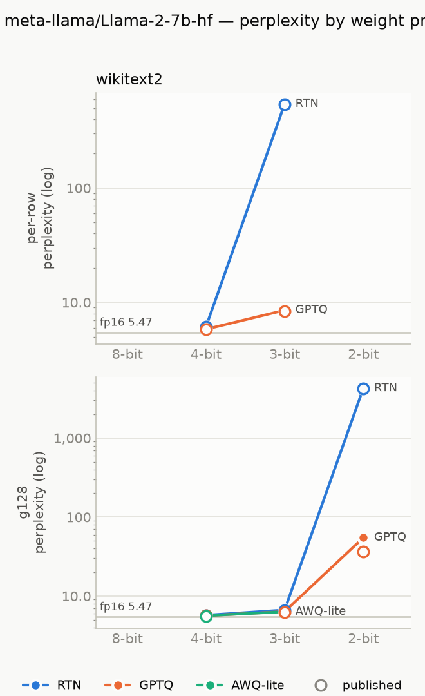
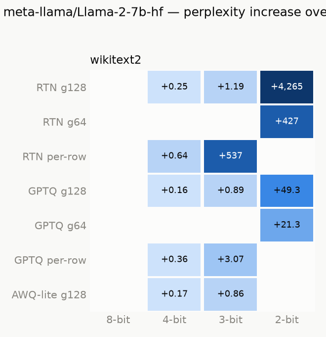

# llama-2-7b-hf

Model: `meta-llama/Llama-2-7b-hf` · generated by `ptq aggregate` from `results/raw/runs/` — do not edit by hand.

**How to read this page.** Perplexity measures how surprised the model is by real text:
lower is better. The *full precision* number is the unmodified model (16-bit weights).
Every other number is the same model after its weights were squeezed to fewer bits;
the percentage says how much worse it got. Under ~5% is barely noticeable, over 2× is
badly damaged. See `results/README.md` for the method and grouping terms.

## Full precision (the baseline)

| dataset | perplexity |
|---|---|
| WikiText-2 (Wikipedia articles) | 5.4721 |

## Best result at each bit width, on WikiText-2 (Wikipedia articles)

| bits | best method | grouping | perplexity | vs full precision |
|---|---|---|---|---|
| 4 | GPTQ | groups of 128 | 5.6346 | +3.0% |
| 3 | AWQ-lite | groups of 128 | 6.3328 | +15.7% |
| 2 | GPTQ | groups of 64 | 26.7500 | 4.9× worse |

## Charts

## Every result: WikiText-2 (Wikipedia articles)

Full precision: 5.4721

| method | grouping | 4-bit | 3-bit | 2-bit |
|---|---|---|---|---|
| AWQ-lite | groups of 128 | 5.6380 (+3.0%) | 6.3328 (+15.7%) | — |
| GPTQ | per row | 5.8303 (+6.5%) | 8.5453 (+56.2%) | — |
| GPTQ | groups of 64 | — | — | 26.7500 (4.9× worse) |
| GPTQ | groups of 128 | 5.6346 (+3.0%) | 6.3624 (+16.3%) | 54.7706 (10× worse) |
| RTN (plain rounding) | per row | 6.1162 (+11.8%) | 542.71 (99× worse) | — |
| RTN (plain rounding) | groups of 64 | — | — | 432.88 (79× worse) |
| RTN (plain rounding) | groups of 128 | 5.7244 (+4.6%) | 6.6636 (+21.8%) | 4,270.61 (780× worse) |

## Checked against published papers

Our number next to the one a paper reports for the same setup. Within about 1% means
this pipeline reproduces the paper.

| dataset | method | bits | grouping | ours | published | difference | source |
|---|---|---|---|---|---|---|---|
| wikitext2 | AWQ-lite | 4 | groups of 128 | 5.6380 | 5.6200 | +0.32% | omniquant:table1 |
| wikitext2 | full precision | 16 | per row | 5.4721 | 5.4700 | +0.04% | awq:table4 |
| wikitext2 | GPTQ | 4 | per row | 5.8303 | 5.8300 | +0.00% | awq:table4 |
| wikitext2 | GPTQ | 4 | groups of 128 | 5.6346 | 5.6900 | -0.97% | awq:table4 |
| wikitext2 | GPTQ | 3 | per row | 8.5453 | 8.3700 | +2.09% | awq:table4 |
| wikitext2 | GPTQ | 3 | groups of 128 | 6.3624 | 6.2900 | +1.15% | awq:table4 |
| wikitext2 | GPTQ | 2 | groups of 64 | 26.7500 | 20.8500 | +28.30% | omniquant:table1 |
| wikitext2 | GPTQ | 2 | groups of 128 | 54.7706 | 36.7700 | +48.95% | omniquant:table1 |
| wikitext2 | RTN (plain rounding) | 4 | per row | 6.1162 | 6.1100 | +0.10% | awq:table4 |
| wikitext2 | RTN (plain rounding) | 4 | groups of 128 | 5.7244 | 5.7300 | -0.10% | awq:table4 |
| wikitext2 | RTN (plain rounding) | 3 | per row | 542.71 | 539.48 | +0.60% | awq:table4 |
| wikitext2 | RTN (plain rounding) | 3 | groups of 128 | 6.6636 | 6.6600 | +0.05% | awq:table4 |
| wikitext2 | RTN (plain rounding) | 2 | groups of 64 | 432.88 | 431.97 | +0.21% | omniquant:table1 |
| wikitext2 | RTN (plain rounding) | 2 | groups of 128 | 4,270.61 | 4,200.00 | +1.68% | omniquant:table1 |

