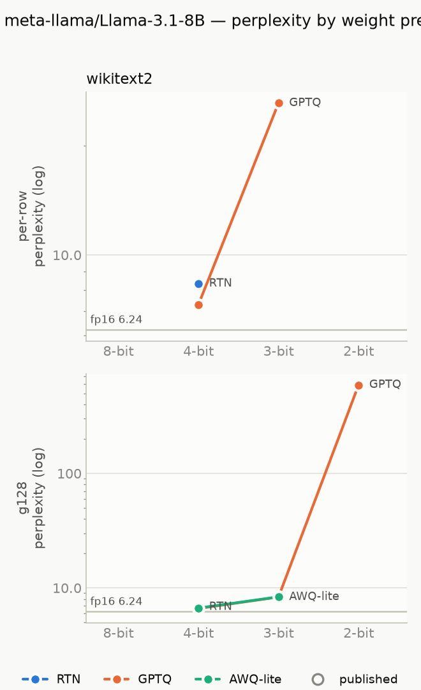
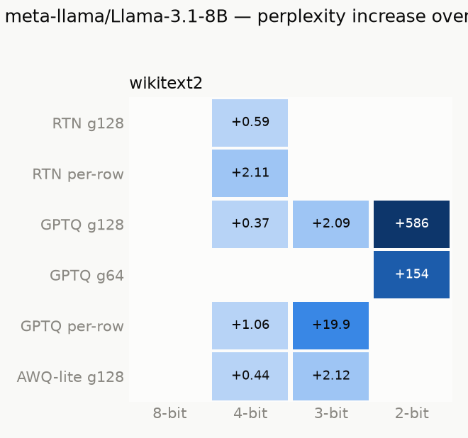

# llama-3.1-8b

Model: `meta-llama/Llama-3.1-8B` · generated by `ptq aggregate` from `results/raw/runs/` — do not edit by hand.

**How to read this page.** Perplexity measures how surprised the model is by real text:
lower is better. The *full precision* number is the unmodified model (16-bit weights).
Every other number is the same model after its weights were squeezed to fewer bits;
the percentage says how much worse it got. Under ~5% is barely noticeable, over 2× is
badly damaged. See `results/README.md` for the method and grouping terms.

## Full precision (the baseline)

| dataset | perplexity |
|---|---|
| WikiText-2 (Wikipedia articles) | 6.2401 |

## Best result at each bit width, on WikiText-2 (Wikipedia articles)

| bits | best method | grouping | perplexity | vs full precision |
|---|---|---|---|---|
| 4 | GPTQ | groups of 128 | 6.6088 | +5.9% |
| 3 | GPTQ | groups of 128 | 8.3351 | +33.6% |
| 2 | GPTQ | groups of 64 | 160.41 | 26× worse |

## Charts

## Every result: WikiText-2 (Wikipedia articles)

Full precision: 6.2401

| method | grouping | 4-bit | 3-bit | 2-bit |
|---|---|---|---|---|
| AWQ-lite | groups of 128 | 6.6768 (+7.0%) | 8.3556 (+33.9%) | — |
| GPTQ | per row | 7.3027 (+17.0%) | 26.1544 (4.2× worse) | — |
| GPTQ | groups of 64 | — | — | 160.41 (26× worse) |
| GPTQ | groups of 128 | 6.6088 (+5.9%) | 8.3351 (+33.6%) | 592.07 (95× worse) |
| RTN (plain rounding) | per row | 8.3452 (+33.7%) | — | — |
| RTN (plain rounding) | groups of 128 | 6.8252 (+9.4%) | — | — |

