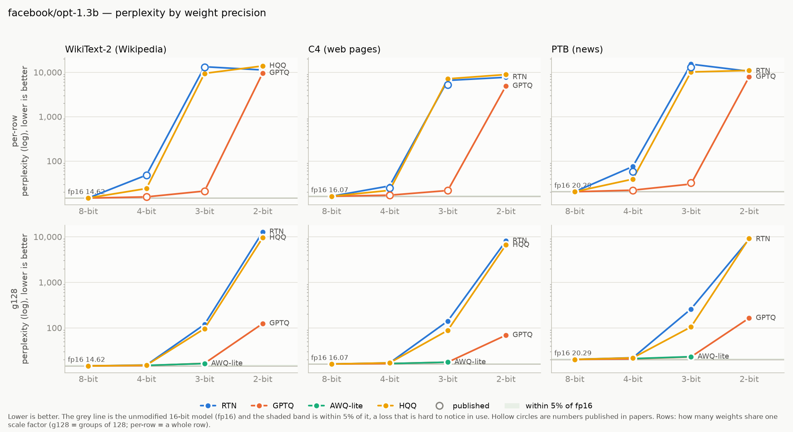
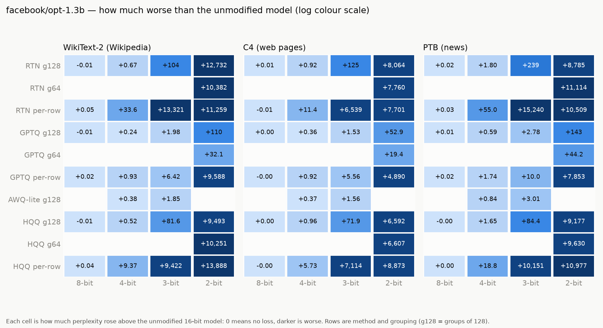

# opt-1.3b

Model: `facebook/opt-1.3b` · generated by `ptq aggregate` from `results/raw/runs/` — do not edit by hand.

**How to read this page.** Perplexity measures how surprised the model is by real text:
lower is better. The *full precision* number is the unmodified model (16-bit weights).
Every other number is the same model after its weights were squeezed to fewer bits;
the percentage says how much worse it got. Under ~5% is barely noticeable, over 2× is
badly damaged. See `results/README.md` for the method and grouping terms.

## Full precision (the baseline)

| dataset | perplexity |
|---|---|
| WikiText-2 (Wikipedia articles) | 14.6239 |
| C4 (web pages) | 16.0709 |
| PTB (1980s news sentences) | 20.2886 |

## Best result at each bit width, on WikiText-2 (Wikipedia articles)

| bits | best method | grouping | perplexity | vs full precision |
|---|---|---|---|---|
| 8 | HQQ | groups of 128 | 14.6096 | -0.1% |
| 4 | GPTQ | groups of 128 | 14.8646 | +1.6% |
| 3 | AWQ-lite | groups of 128 | 16.4698 | +12.6% |
| 2 | GPTQ | groups of 64 | 46.7674 | 3.2× worse |

## Charts

## Every result: WikiText-2 (Wikipedia articles)

Full precision: 14.6239

| method | grouping | 8-bit | 4-bit | 3-bit | 2-bit |
|---|---|---|---|---|---|
| AWQ-lite | groups of 128 | — | 15.0014 (+2.6%) | 16.4698 (+12.6%) | — |
| GPTQ | per row | 14.6392 (+0.1%) | 15.5521 (+6.3%) | 21.0486 (+43.9%) | 9,602.18 (657× worse) |
| GPTQ | groups of 64 | — | — | — | 46.7674 (3.2× worse) |
| GPTQ | groups of 128 | 14.6142 (-0.1%) | 14.8646 (+1.6%) | 16.6067 (+13.6%) | 124.39 (8.5× worse) |
| HQQ | per row | 14.6608 (+0.3%) | 23.9925 (+64.1%) | 9,436.81 (645× worse) | 13,902.88 (951× worse) |
| HQQ | groups of 64 | — | — | — | 10,265.71 (702× worse) |
| HQQ | groups of 128 | 14.6096 (-0.1%) | 15.1439 (+3.6%) | 96.2272 (6.6× worse) | 9,507.36 (650× worse) |
| RTN (plain rounding) | per row | 14.6779 (+0.4%) | 48.1823 (3.3× worse) | 13,335.91 (912× worse) | 11,273.15 (771× worse) |
| RTN (plain rounding) | groups of 64 | — | — | — | 10,396.85 (711× worse) |
| RTN (plain rounding) | groups of 128 | 14.6132 (-0.1%) | 15.2939 (+4.6%) | 118.87 (8.1× worse) | 12,746.41 (872× worse) |

## Every result: C4 (web pages)

Full precision: 16.0709

| method | grouping | 8-bit | 4-bit | 3-bit | 2-bit |
|---|---|---|---|---|---|
| AWQ-lite | groups of 128 | — | 16.4448 (+2.3%) | 17.6302 (+9.7%) | — |
| GPTQ | per row | 16.0701 (-0.0%) | 16.9906 (+5.7%) | 21.6304 (+34.6%) | 4,906.14 (305× worse) |
| GPTQ | groups of 64 | — | — | — | 35.4658 (2.2× worse) |
| GPTQ | groups of 128 | 16.0749 (+0.0%) | 16.4327 (+2.3%) | 17.6028 (+9.5%) | 69.0075 (4.3× worse) |
| HQQ | per row | 16.0700 (-0.0%) | 21.8045 (+35.7%) | 7,129.60 (444× worse) | 8,889.23 (553× worse) |
| HQQ | groups of 64 | — | — | — | 6,622.67 (412× worse) |
| HQQ | groups of 128 | 16.0745 (+0.0%) | 17.0342 (+6.0%) | 87.9804 (5.5× worse) | 6,608.09 (411× worse) |
| RTN (plain rounding) | per row | 16.0645 (-0.0%) | 27.4884 (+71.0%) | 6,554.71 (408× worse) | 7,716.64 (480× worse) |
| RTN (plain rounding) | groups of 64 | — | — | — | 7,776.29 (484× worse) |
| RTN (plain rounding) | groups of 128 | 16.0770 (+0.0%) | 16.9919 (+5.7%) | 141.10 (8.8× worse) | 8,080.13 (503× worse) |

## Every result: PTB (1980s news sentences)

Full precision: 20.2886

| method | grouping | 8-bit | 4-bit | 3-bit | 2-bit |
|---|---|---|---|---|---|
| AWQ-lite | groups of 128 | — | 21.1327 (+4.2%) | 23.2937 (+14.8%) | — |
| GPTQ | per row | 20.3075 (+0.1%) | 22.0323 (+8.6%) | 30.3029 (+49.4%) | 7,873.14 (388× worse) |
| GPTQ | groups of 64 | — | — | — | 64.5205 (3.2× worse) |
| GPTQ | groups of 128 | 20.2967 (+0.0%) | 20.8754 (+2.9%) | 23.0659 (+13.7%) | 163.77 (8.1× worse) |
| HQQ | per row | 20.2893 (+0.0%) | 39.1104 (+92.8%) | 10,171.52 (501× worse) | 10,997.16 (542× worse) |
| HQQ | groups of 64 | — | — | — | 9,650.17 (476× worse) |
| HQQ | groups of 128 | 20.2864 (-0.0%) | 21.9336 (+8.1%) | 104.64 (5.2× worse) | 9,197.17 (453× worse) |
| RTN (plain rounding) | per row | 20.3182 (+0.1%) | 75.3325 (3.7× worse) | 15,260.62 (752× worse) | 10,529.03 (519× worse) |
| RTN (plain rounding) | groups of 64 | — | — | — | 11,133.94 (549× worse) |
| RTN (plain rounding) | groups of 128 | 20.3060 (+0.1%) | 22.0901 (+8.9%) | 259.17 (13× worse) | 8,805.41 (434× worse) |

## Checked against published papers

Our number next to the one a paper reports for the same setup. Within about 1% means
this pipeline reproduces the paper.

| dataset | method | bits | grouping | ours | published | difference | source |
|---|---|---|---|---|---|---|---|
| c4_new | full precision | 16 | per row | 16.0709 | 16.0700 | +0.01% | gptq:table11 |
| c4_new | GPTQ | 4 | per row | 16.9906 | 16.9700 | +0.12% | gptq:table11 |
| c4_new | GPTQ | 3 | per row | 21.6304 | 21.6300 | +0.00% | gptq:table11 |
| c4_new | RTN (plain rounding) | 4 | per row | 27.4884 | 24.5100 | +12.15% | gptq:table11 |
| c4_new | RTN (plain rounding) | 3 | per row | 6,554.71 | 5,200.00 | +26.05% | gptq:table11 |
| ptb_new | full precision | 16 | per row | 20.2886 | 20.2900 | -0.01% | gptq:table9 |
| ptb_new | GPTQ | 4 | per row | 22.0323 | 21.8500 | +0.83% | gptq:table9 |
| ptb_new | GPTQ | 3 | per row | 30.3029 | 32.1000 | -5.60% | gptq:table9 |
| ptb_new | RTN (plain rounding) | 4 | per row | 75.3325 | 57.3000 | +31.47% | gptq:table9 |
| ptb_new | RTN (plain rounding) | 3 | per row | 15,260.62 | 13,000.00 | +17.39% | gptq:table9 |
| wikitext2 | full precision | 16 | per row | 14.6239 | 14.6300 | -0.04% | gptq:table3 |
| wikitext2 | GPTQ | 4 | per row | 15.5521 | 15.4700 | +0.53% | gptq:table3 |
| wikitext2 | GPTQ | 3 | per row | 21.0486 | 20.9700 | +0.37% | gptq:table3 |
| wikitext2 | RTN (plain rounding) | 4 | per row | 48.1823 | 48.1700 | +0.03% | gptq:table3 |
| wikitext2 | RTN (plain rounding) | 3 | per row | 13,335.91 | 13,000.00 | +2.58% | gptq:table3 |

