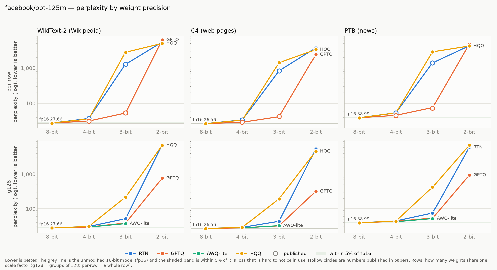
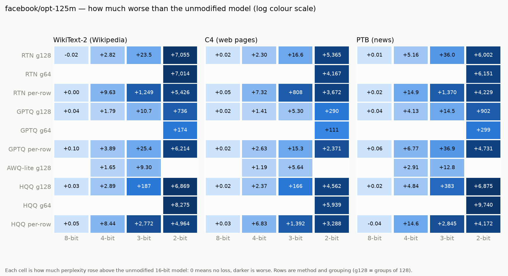

# opt-125m

Model: `facebook/opt-125m` · generated by `ptq aggregate` from `results/raw/runs/` — do not edit by hand.

**How to read this page.** Perplexity measures how surprised the model is by real text:
lower is better. The *full precision* number is the unmodified model (16-bit weights).
Every other number is the same model after its weights were squeezed to fewer bits;
the percentage says how much worse it got. Under ~5% is barely noticeable, over 2× is
badly damaged. See `results/README.md` for the method and grouping terms.

## Full precision (the baseline)

| dataset | perplexity |
|---|---|
| WikiText-2 (Wikipedia articles) | 27.6559 |
| C4 (web pages) | 26.5637 |
| PTB (1980s news sentences) | 38.9917 |

## Best result at each bit width, on WikiText-2 (Wikipedia articles)

| bits | best method | grouping | perplexity | vs full precision |
|---|---|---|---|---|
| 8 | RTN (plain rounding) | groups of 128 | 27.6408 | -0.1% |
| 4 | AWQ-lite | groups of 128 | 29.3020 | +6.0% |
| 3 | AWQ-lite | groups of 128 | 36.9550 | +33.6% |
| 2 | GPTQ | groups of 64 | 201.41 | 7.3× worse |

## Charts

## Every result: WikiText-2 (Wikipedia articles)

Full precision: 27.6559

| method | grouping | 8-bit | 4-bit | 3-bit | 2-bit |
|---|---|---|---|---|---|
| AWQ-lite | groups of 128 | — | 29.3020 (+6.0%) | 36.9550 (+33.6%) | — |
| GPTQ | per row | 27.7522 (+0.3%) | 31.5475 (+14.1%) | 53.0273 (+91.7%) | 6,241.72 (226× worse) |
| GPTQ | groups of 64 | — | — | — | 201.41 (7.3× worse) |
| GPTQ | groups of 128 | 27.6950 (+0.1%) | 29.4503 (+6.5%) | 38.3548 (+38.7%) | 763.28 (28× worse) |
| HQQ | per row | 27.7080 (+0.2%) | 36.1005 (+30.5%) | 2,800.07 (101× worse) | 4,991.39 (180× worse) |
| HQQ | groups of 64 | — | — | — | 8,302.81 (300× worse) |
| HQQ | groups of 128 | 27.6842 (+0.1%) | 30.5426 (+10.4%) | 214.91 (7.8× worse) | 6,897.01 (249× worse) |
| RTN (plain rounding) | per row | 27.6595 (+0.0%) | 37.2831 (+34.8%) | 1,277.11 (46× worse) | 5,453.51 (197× worse) |
| RTN (plain rounding) | groups of 64 | — | — | — | 7,041.65 (255× worse) |
| RTN (plain rounding) | groups of 128 | 27.6408 (-0.1%) | 30.4803 (+10.2%) | 51.2001 (+85.1%) | 7,082.27 (256× worse) |

## Every result: C4 (web pages)

Full precision: 26.5637

| method | grouping | 8-bit | 4-bit | 3-bit | 2-bit |
|---|---|---|---|---|---|
| AWQ-lite | groups of 128 | — | 27.7575 (+4.5%) | 32.1995 (+21.2%) | — |
| GPTQ | per row | 26.5851 (+0.1%) | 29.1953 (+9.9%) | 41.9121 (+57.8%) | 2,397.73 (90× worse) |
| GPTQ | groups of 64 | — | — | — | 137.25 (5.2× worse) |
| GPTQ | groups of 128 | 26.5819 (+0.1%) | 27.9786 (+5.3%) | 31.8616 (+19.9%) | 316.53 (12× worse) |
| HQQ | per row | 26.5967 (+0.1%) | 33.3985 (+25.7%) | 1,418.91 (53× worse) | 3,314.32 (125× worse) |
| HQQ | groups of 64 | — | — | — | 5,965.14 (225× worse) |
| HQQ | groups of 128 | 26.5802 (+0.1%) | 28.9321 (+8.9%) | 193.01 (7.3× worse) | 4,588.82 (173× worse) |
| RTN (plain rounding) | per row | 26.6187 (+0.2%) | 33.8850 (+27.6%) | 834.40 (31× worse) | 3,698.74 (139× worse) |
| RTN (plain rounding) | groups of 64 | — | — | — | 4,193.36 (158× worse) |
| RTN (plain rounding) | groups of 128 | 26.5791 (+0.1%) | 28.8617 (+8.7%) | 43.1718 (+62.5%) | 5,391.50 (203× worse) |

## Every result: PTB (1980s news sentences)

Full precision: 38.9917

| method | grouping | 8-bit | 4-bit | 3-bit | 2-bit |
|---|---|---|---|---|---|
| AWQ-lite | groups of 128 | — | 41.9041 (+7.5%) | 51.8142 (+32.9%) | — |
| GPTQ | per row | 39.0566 (+0.2%) | 45.7609 (+17.4%) | 75.8880 (+94.6%) | 4,770.03 (122× worse) |
| GPTQ | groups of 64 | — | — | — | 338.48 (8.7× worse) |
| GPTQ | groups of 128 | 39.0344 (+0.1%) | 43.1253 (+10.6%) | 53.4636 (+37.1%) | 941.02 (24× worse) |
| HQQ | per row | 38.9504 (-0.1%) | 53.6291 (+37.5%) | 2,884.12 (74× worse) | 4,211.33 (108× worse) |
| HQQ | groups of 64 | — | — | — | 9,778.62 (251× worse) |
| HQQ | groups of 128 | 39.0141 (+0.1%) | 43.8352 (+12.4%) | 422.40 (11× worse) | 6,913.67 (177× worse) |
| RTN (plain rounding) | per row | 39.0080 (+0.0%) | 53.8840 (+38.2%) | 1,408.78 (36× worse) | 4,267.62 (109× worse) |
| RTN (plain rounding) | groups of 64 | — | — | — | 6,189.76 (159× worse) |
| RTN (plain rounding) | groups of 128 | 39.0042 (+0.0%) | 44.1468 (+13.2%) | 74.9494 (+92.2%) | 6,040.85 (155× worse) |

## Checked against published papers

Our number next to the one a paper reports for the same setup. Within about 1% means
this pipeline reproduces the paper.

| dataset | method | bits | grouping | ours | published | difference | source |
|---|---|---|---|---|---|---|---|
| c4_new | full precision | 16 | per row | 26.5637 | 26.5600 | +0.01% | gptq:table11 |
| c4_new | GPTQ | 4 | per row | 29.1953 | 29.2200 | -0.08% | gptq:table11 |
| c4_new | GPTQ | 3 | per row | 41.9121 | 42.4100 | -1.17% | gptq:table11 |
| c4_new | RTN (plain rounding) | 4 | per row | 33.8850 | 33.9100 | -0.07% | gptq:table11 |
| c4_new | RTN (plain rounding) | 3 | per row | 834.40 | 834.00 | +0.05% | gptq:table11 |
| ptb_new | full precision | 16 | per row | 38.9917 | 38.9900 | +0.00% | gptq:table9 |
| ptb_new | GPTQ | 4 | per row | 45.7609 | 45.1700 | +1.31% | gptq:table9 |
| ptb_new | GPTQ | 3 | per row | 75.8880 | 73.1900 | +3.69% | gptq:table9 |
| ptb_new | RTN (plain rounding) | 4 | per row | 53.8840 | 53.8900 | -0.01% | gptq:table9 |
| ptb_new | RTN (plain rounding) | 3 | per row | 1,408.78 | 1,400.00 | +0.63% | gptq:table9 |
| wikitext2 | full precision | 16 | per row | 27.6559 | 27.6500 | +0.02% | gptq:table3 |
| wikitext2 | GPTQ | 4 | per row | 31.5475 | 31.1200 | +1.37% | gptq:table3 |
| wikitext2 | GPTQ | 3 | per row | 53.0273 | 53.8500 | -1.53% | gptq:table3 |
| wikitext2 | RTN (plain rounding) | 4 | per row | 37.2831 | 37.2800 | +0.01% | gptq:table3 |
| wikitext2 | RTN (plain rounding) | 3 | per row | 1,277.11 | 1,300.00 | -1.76% | gptq:table3 |

