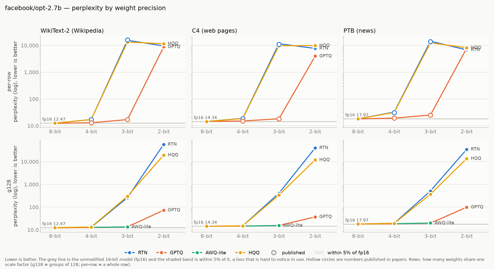
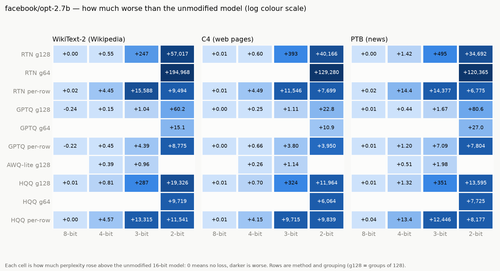

# opt-2.7b

Model: `facebook/opt-2.7b` · generated by `ptq aggregate` from `results/raw/runs/` — do not edit by hand.

**How to read this page.** Perplexity measures how surprised the model is by real text:
lower is better. The *full precision* number is the unmodified model (16-bit weights).
Every other number is the same model after its weights were squeezed to fewer bits;
the percentage says how much worse it got. Under ~5% is barely noticeable, over 2× is
badly damaged. See `results/README.md` for the method and grouping terms.

## Full precision (the baseline)

| dataset | perplexity |
|---|---|
| WikiText-2 (Wikipedia articles) | 12.4711 |
| C4 (web pages) | 14.3426 |
| PTB (1980s news sentences) | 17.9737 |

## Best result at each bit width, on WikiText-2 (Wikipedia articles)

| bits | best method | grouping | perplexity | vs full precision |
|---|---|---|---|---|
| 8 | GPTQ | groups of 128 | 12.2291 | -1.9% |
| 4 | GPTQ | groups of 128 | 12.6244 | +1.2% |
| 3 | AWQ-lite | groups of 128 | 13.4310 | +7.7% |
| 2 | GPTQ | groups of 64 | 27.6024 | 2.2× worse |

## Charts

## Every result: WikiText-2 (Wikipedia articles)

Full precision: 12.4711

| method | grouping | 8-bit | 4-bit | 3-bit | 2-bit |
|---|---|---|---|---|---|
| AWQ-lite | groups of 128 | — | 12.8590 (+3.1%) | 13.4310 (+7.7%) | — |
| GPTQ | per row | 12.2472 (-1.8%) | 12.9175 (+3.6%) | 16.8655 (+35.2%) | 8,787.80 (705× worse) |
| GPTQ | groups of 64 | — | — | — | 27.6024 (2.2× worse) |
| GPTQ | groups of 128 | 12.2291 (-1.9%) | 12.6244 (+1.2%) | 13.5082 (+8.3%) | 72.7156 (5.8× worse) |
| HQQ | per row | 12.4741 (+0.0%) | 17.0376 (+36.6%) | 13,327.92 (1,069× worse) | 11,553.74 (926× worse) |
| HQQ | groups of 64 | — | — | — | 9,731.79 (780× worse) |
| HQQ | groups of 128 | 12.4779 (+0.1%) | 13.2774 (+6.5%) | 298.98 (24× worse) | 19,338.72 (1,551× worse) |
| RTN (plain rounding) | per row | 12.4886 (+0.1%) | 16.9224 (+35.7%) | 15,600.51 (1,251× worse) | 9,506.37 (762× worse) |
| RTN (plain rounding) | groups of 64 | — | — | — | 194,980.87 (15,635× worse) |
| RTN (plain rounding) | groups of 128 | 12.4713 (+0.0%) | 13.0224 (+4.4%) | 259.87 (21× worse) | 57,029.54 (4,573× worse) |

## Every result: C4 (web pages)

Full precision: 14.3426

| method | grouping | 8-bit | 4-bit | 3-bit | 2-bit |
|---|---|---|---|---|---|
| AWQ-lite | groups of 128 | — | 14.6019 (+1.8%) | 15.4779 (+7.9%) | — |
| GPTQ | per row | 14.3436 (+0.0%) | 14.9982 (+4.6%) | 18.1404 (+26.5%) | 3,964.00 (276× worse) |
| GPTQ | groups of 64 | — | — | — | 25.2571 (+76.1%) |
| GPTQ | groups of 128 | 14.3456 (+0.0%) | 14.5932 (+1.7%) | 15.4480 (+7.7%) | 37.1322 (2.6× worse) |
| HQQ | per row | 14.3482 (+0.0%) | 18.4920 (+28.9%) | 9,729.52 (678× worse) | 9,852.98 (687× worse) |
| HQQ | groups of 64 | — | — | — | 6,078.04 (424× worse) |
| HQQ | groups of 128 | 14.3477 (+0.0%) | 15.0450 (+4.9%) | 338.10 (24× worse) | 11,978.32 (835× worse) |
| RTN (plain rounding) | per row | 14.3487 (+0.0%) | 18.8276 (+31.3%) | 11,560.31 (806× worse) | 7,713.23 (538× worse) |
| RTN (plain rounding) | groups of 64 | — | — | — | 129,294.38 (9,015× worse) |
| RTN (plain rounding) | groups of 128 | 14.3505 (+0.1%) | 14.9423 (+4.2%) | 407.49 (28× worse) | 40,179.95 (2,801× worse) |

## Every result: PTB (1980s news sentences)

Full precision: 17.9737

| method | grouping | 8-bit | 4-bit | 3-bit | 2-bit |
|---|---|---|---|---|---|
| AWQ-lite | groups of 128 | — | 18.4813 (+2.8%) | 19.9556 (+11.0%) | — |
| GPTQ | per row | 17.9883 (+0.1%) | 19.1700 (+6.7%) | 25.0646 (+39.5%) | 7,821.97 (435× worse) |
| GPTQ | groups of 64 | — | — | — | 44.9342 (2.5× worse) |
| GPTQ | groups of 128 | 17.9819 (+0.0%) | 18.4170 (+2.5%) | 19.6428 (+9.3%) | 98.6097 (5.5× worse) |
| HQQ | per row | 18.0127 (+0.2%) | 31.3511 (+74.4%) | 12,464.39 (693× worse) | 8,194.62 (456× worse) |
| HQQ | groups of 64 | — | — | — | 7,742.50 (431× worse) |
| HQQ | groups of 128 | 17.9816 (+0.0%) | 19.2952 (+7.4%) | 368.84 (21× worse) | 13,612.89 (757× worse) |
| RTN (plain rounding) | per row | 17.9893 (+0.1%) | 32.4115 (+80.3%) | 14,394.60 (801× worse) | 6,793.13 (378× worse) |
| RTN (plain rounding) | groups of 64 | — | — | — | 120,383.40 (6,698× worse) |
| RTN (plain rounding) | groups of 128 | 17.9780 (+0.0%) | 19.3958 (+7.9%) | 512.77 (29× worse) | 34,709.76 (1,931× worse) |

## Checked against published papers

Our number next to the one a paper reports for the same setup. Within about 1% means
this pipeline reproduces the paper.

| dataset | method | bits | grouping | ours | published | difference | source |
|---|---|---|---|---|---|---|---|
| c4_new | full precision | 16 | per row | 14.3426 | 14.3400 | +0.02% | gptq:table11 |
| c4_new | GPTQ | 4 | per row | 14.9982 | 15.0000 | -0.01% | gptq:table11 |
| c4_new | GPTQ | 3 | per row | 18.1404 | 18.1700 | -0.16% | gptq:table11 |
| c4_new | RTN (plain rounding) | 4 | per row | 18.8276 | 18.4300 | +2.16% | gptq:table11 |
| c4_new | RTN (plain rounding) | 3 | per row | 11,560.31 | 11,000.00 | +5.09% | gptq:table11 |
| ptb_new | full precision | 16 | per row | 17.9737 | 17.9700 | +0.02% | gptq:table9 |
| ptb_new | GPTQ | 4 | per row | 19.1700 | 19.1400 | +0.16% | gptq:table9 |
| ptb_new | GPTQ | 3 | per row | 25.0646 | 24.8100 | +1.03% | gptq:table9 |
| ptb_new | RTN (plain rounding) | 4 | per row | 32.4115 | 31.0500 | +4.38% | gptq:table9 |
| ptb_new | RTN (plain rounding) | 3 | per row | 14,394.60 | 14,000.00 | +2.82% | gptq:table9 |
| wikitext2 | full precision | 16 | per row | 12.4711 | 12.4700 | +0.01% | gptq:table3 |
| wikitext2 | GPTQ | 4 | per row | 12.9175 | 12.8700 | +0.37% | gptq:table3 |
| wikitext2 | GPTQ | 3 | per row | 16.8655 | 16.8800 | -0.09% | gptq:table3 |
| wikitext2 | RTN (plain rounding) | 4 | per row | 16.9224 | 16.9200 | +0.01% | gptq:table3 |
| wikitext2 | RTN (plain rounding) | 3 | per row | 15,600.51 | 16,000.00 | -2.50% | gptq:table3 |

