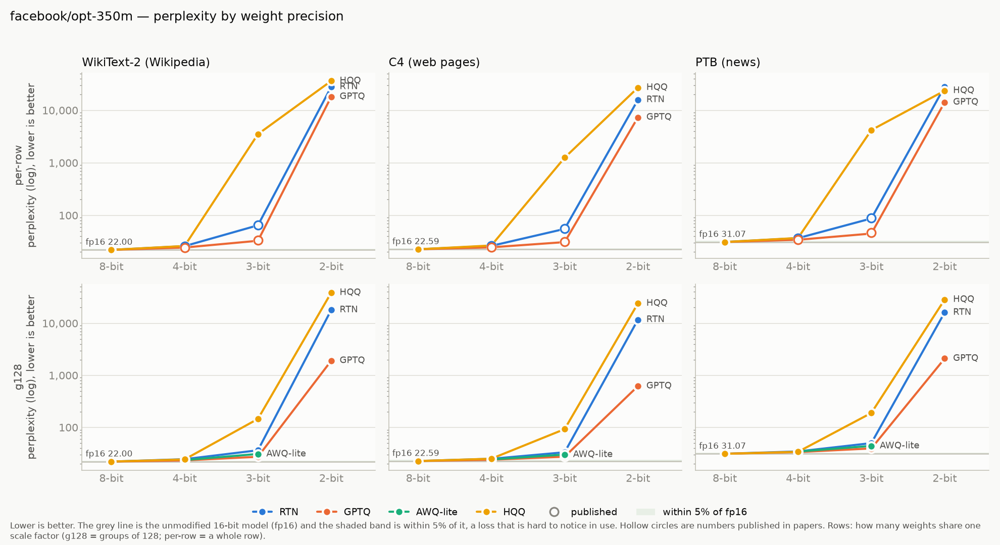
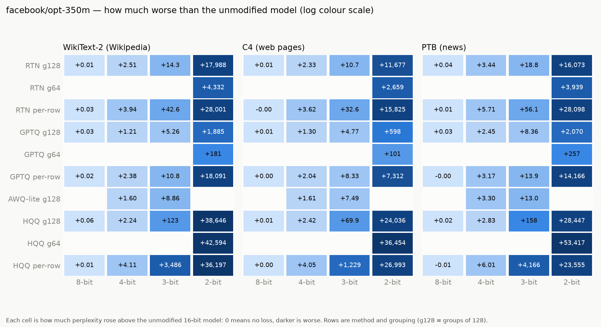

# opt-350m

Model: `facebook/opt-350m` · generated by `ptq aggregate` from `results/raw/runs/` — do not edit by hand.

**How to read this page.** Perplexity measures how surprised the model is by real text:
lower is better. The *full precision* number is the unmodified model (16-bit weights).
Every other number is the same model after its weights were squeezed to fewer bits;
the percentage says how much worse it got. Under ~5% is barely noticeable, over 2× is
badly damaged. See `results/README.md` for the method and grouping terms.

## Full precision (the baseline)

| dataset | perplexity |
|---|---|
| WikiText-2 (Wikipedia articles) | 22.0017 |
| C4 (web pages) | 22.5896 |
| PTB (1980s news sentences) | 31.0739 |

## Best result at each bit width, on WikiText-2 (Wikipedia articles)

| bits | best method | grouping | perplexity | vs full precision |
|---|---|---|---|---|
| 8 | HQQ | per row | 22.0107 | +0.0% |
| 4 | GPTQ | groups of 128 | 23.2116 | +5.5% |
| 3 | GPTQ | groups of 128 | 27.2601 | +23.9% |
| 2 | GPTQ | groups of 64 | 202.74 | 9.2× worse |

## Charts

## Every result: WikiText-2 (Wikipedia articles)

Full precision: 22.0017

| method | grouping | 8-bit | 4-bit | 3-bit | 2-bit |
|---|---|---|---|---|---|
| AWQ-lite | groups of 128 | — | 23.6018 (+7.3%) | 30.8610 (+40.3%) | — |
| GPTQ | per row | 22.0213 (+0.1%) | 24.3851 (+10.8%) | 32.7896 (+49.0%) | 18,112.52 (823× worse) |
| GPTQ | groups of 64 | — | — | — | 202.74 (9.2× worse) |
| GPTQ | groups of 128 | 22.0290 (+0.1%) | 23.2116 (+5.5%) | 27.2601 (+23.9%) | 1,907.49 (87× worse) |
| HQQ | per row | 22.0107 (+0.0%) | 26.1114 (+18.7%) | 3,507.70 (159× worse) | 36,218.54 (1,646× worse) |
| HQQ | groups of 64 | — | — | — | 42,616.39 (1,937× worse) |
| HQQ | groups of 128 | 22.0664 (+0.3%) | 24.2444 (+10.2%) | 145.43 (6.6× worse) | 38,668.47 (1,758× worse) |
| RTN (plain rounding) | per row | 22.0286 (+0.1%) | 25.9412 (+17.9%) | 64.5576 (2.9× worse) | 28,023.09 (1,274× worse) |
| RTN (plain rounding) | groups of 64 | — | — | — | 4,354.26 (198× worse) |
| RTN (plain rounding) | groups of 128 | 22.0112 (+0.0%) | 24.5108 (+11.4%) | 36.3295 (+65.1%) | 18,010.48 (819× worse) |

## Every result: C4 (web pages)

Full precision: 22.5896

| method | grouping | 8-bit | 4-bit | 3-bit | 2-bit |
|---|---|---|---|---|---|
| AWQ-lite | groups of 128 | — | 24.2008 (+7.1%) | 30.0819 (+33.2%) | — |
| GPTQ | per row | 22.5928 (+0.0%) | 24.6259 (+9.0%) | 30.9220 (+36.9%) | 7,334.71 (325× worse) |
| GPTQ | groups of 64 | — | — | — | 123.13 (5.5× worse) |
| GPTQ | groups of 128 | 22.5981 (+0.0%) | 23.8910 (+5.8%) | 27.3608 (+21.1%) | 620.26 (27× worse) |
| HQQ | per row | 22.5939 (+0.0%) | 26.6415 (+17.9%) | 1,252.00 (55× worse) | 27,015.77 (1,196× worse) |
| HQQ | groups of 64 | — | — | — | 36,476.18 (1,615× worse) |
| HQQ | groups of 128 | 22.6018 (+0.1%) | 25.0092 (+10.7%) | 92.5206 (4.1× worse) | 24,058.90 (1,065× worse) |
| RTN (plain rounding) | per row | 22.5879 (-0.0%) | 26.2108 (+16.0%) | 55.1503 (2.4× worse) | 15,847.59 (702× worse) |
| RTN (plain rounding) | groups of 64 | — | — | — | 2,681.96 (119× worse) |
| RTN (plain rounding) | groups of 128 | 22.5979 (+0.0%) | 24.9242 (+10.3%) | 33.2445 (+47.2%) | 11,699.18 (518× worse) |

## Every result: PTB (1980s news sentences)

Full precision: 31.0739

| method | grouping | 8-bit | 4-bit | 3-bit | 2-bit |
|---|---|---|---|---|---|
| AWQ-lite | groups of 128 | — | 34.3782 (+10.6%) | 44.1153 (+42.0%) | — |
| GPTQ | per row | 31.0705 (-0.0%) | 34.2448 (+10.2%) | 44.9873 (+44.8%) | 14,197.41 (457× worse) |
| GPTQ | groups of 64 | — | — | — | 287.98 (9.3× worse) |
| GPTQ | groups of 128 | 31.1071 (+0.1%) | 33.5272 (+7.9%) | 39.4315 (+26.9%) | 2,101.49 (68× worse) |
| HQQ | per row | 31.0642 (-0.0%) | 37.0854 (+19.3%) | 4,197.41 (135× worse) | 23,586.15 (759× worse) |
| HQQ | groups of 64 | — | — | — | 53,447.94 (1,720× worse) |
| HQQ | groups of 128 | 31.0975 (+0.1%) | 33.8997 (+9.1%) | 189.15 (6.1× worse) | 28,477.61 (916× worse) |
| RTN (plain rounding) | per row | 31.0841 (+0.0%) | 36.7852 (+18.4%) | 87.2050 (2.8× worse) | 28,128.59 (905× worse) |
| RTN (plain rounding) | groups of 64 | — | — | — | 3,970.26 (128× worse) |
| RTN (plain rounding) | groups of 128 | 31.1113 (+0.1%) | 34.5144 (+11.1%) | 49.8541 (+60.4%) | 16,104.50 (518× worse) |

## Checked against published papers

Our number next to the one a paper reports for the same setup. Within about 1% means
this pipeline reproduces the paper.

| dataset | method | bits | grouping | ours | published | difference | source |
|---|---|---|---|---|---|---|---|
| c4_new | full precision | 16 | per row | 22.5896 | 22.5900 | -0.00% | gptq:table11 |
| c4_new | GPTQ | 4 | per row | 24.6259 | 24.6300 | -0.02% | gptq:table11 |
| c4_new | GPTQ | 3 | per row | 30.9220 | 31.3300 | -1.30% | gptq:table11 |
| c4_new | RTN (plain rounding) | 4 | per row | 26.2108 | 26.2100 | +0.00% | gptq:table11 |
| c4_new | RTN (plain rounding) | 3 | per row | 55.1503 | 55.4900 | -0.61% | gptq:table11 |
| ptb_new | full precision | 16 | per row | 31.0739 | 31.0800 | -0.02% | gptq:table9 |
| ptb_new | GPTQ | 4 | per row | 34.2448 | 34.5200 | -0.80% | gptq:table9 |
| ptb_new | GPTQ | 3 | per row | 44.9873 | 47.0800 | -4.44% | gptq:table9 |
| ptb_new | RTN (plain rounding) | 4 | per row | 36.7852 | 36.7900 | -0.01% | gptq:table9 |
| ptb_new | RTN (plain rounding) | 3 | per row | 87.2050 | 88.0400 | -0.95% | gptq:table9 |
| wikitext2 | full precision | 16 | per row | 22.0017 | 22.0000 | +0.01% | gptq:table3 |
| wikitext2 | GPTQ | 4 | per row | 24.3851 | 24.2400 | +0.60% | gptq:table3 |
| wikitext2 | GPTQ | 3 | per row | 32.7896 | 33.7900 | -2.96% | gptq:table3 |
| wikitext2 | RTN (plain rounding) | 4 | per row | 25.9412 | 25.9400 | +0.00% | gptq:table3 |
| wikitext2 | RTN (plain rounding) | 3 | per row | 64.5576 | 64.5700 | -0.02% | gptq:table3 |

