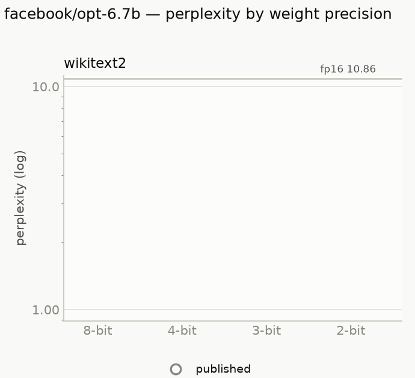
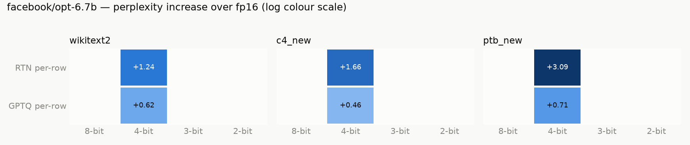

# opt-6.7b

Model: `facebook/opt-6.7b` · generated by `ptq aggregate` from `results/raw/runs/` — do not edit by hand.

**How to read this page.** Perplexity measures how surprised the model is by real text:
lower is better. The *full precision* number is the unmodified model (16-bit weights).
Every other number is the same model after its weights were squeezed to fewer bits;
the percentage says how much worse it got. Under ~5% is barely noticeable, over 2× is
badly damaged. See `results/README.md` for the method and grouping terms.

## Full precision (the baseline)

| dataset | perplexity |
|---|---|
| WikiText-2 (Wikipedia articles) | 10.8603 |
| C4 (web pages) | 12.7121 |
| PTB (1980s news sentences) | 15.7699 |

## Best result at each bit width, on WikiText-2 (Wikipedia articles)

| bits | best method | grouping | perplexity | vs full precision |
|---|---|---|---|---|
| 4 | GPTQ | per row | 11.4774 | +5.7% |

## Charts

## Every result: WikiText-2 (Wikipedia articles)

Full precision: 10.8603

| method | grouping | 4-bit |
|---|---|---|
| GPTQ | per row | 11.4774 (+5.7%) |
| RTN (plain rounding) | per row | 12.0992 (+11.4%) |

## Every result: C4 (web pages)

Full precision: 12.7121

| method | grouping | 4-bit |
|---|---|---|
| GPTQ | per row | 13.1715 (+3.6%) |
| RTN (plain rounding) | per row | 14.3730 (+13.1%) |

## Every result: PTB (1980s news sentences)

Full precision: 15.7699

| method | grouping | 4-bit |
|---|---|---|
| GPTQ | per row | 16.4841 (+4.5%) |
| RTN (plain rounding) | per row | 18.8578 (+19.6%) |

## Checked against published papers

Our number next to the one a paper reports for the same setup. Within about 1% means
this pipeline reproduces the paper.

| dataset | method | bits | grouping | ours | published | difference | source |
|---|---|---|---|---|---|---|---|
| c4_new | full precision | 16 | per row | 12.7121 | 12.7100 | +0.02% | gptq:table11 |
| c4_new | GPTQ | 4 | per row | 13.1715 | 13.1800 | -0.06% | gptq:table11 |
| c4_new | RTN (plain rounding) | 4 | per row | 14.3730 | 14.3600 | +0.09% | gptq:table11 |
| ptb_new | full precision | 16 | per row | 15.7699 | 15.7700 | -0.00% | gptq:table9 |
| ptb_new | GPTQ | 4 | per row | 16.4841 | 16.5600 | -0.46% | gptq:table9 |
| ptb_new | RTN (plain rounding) | 4 | per row | 18.8578 | 18.8400 | +0.09% | gptq:table9 |
| wikitext2 | full precision | 16 | per row | 10.8603 | 10.8600 | +0.00% | gptq:table3 |
| wikitext2 | GPTQ | 4 | per row | 11.4774 | 11.3900 | +0.77% | gptq:table3 |
| wikitext2 | RTN (plain rounding) | 4 | per row | 12.0992 | 12.1000 | -0.01% | gptq:table3 |

