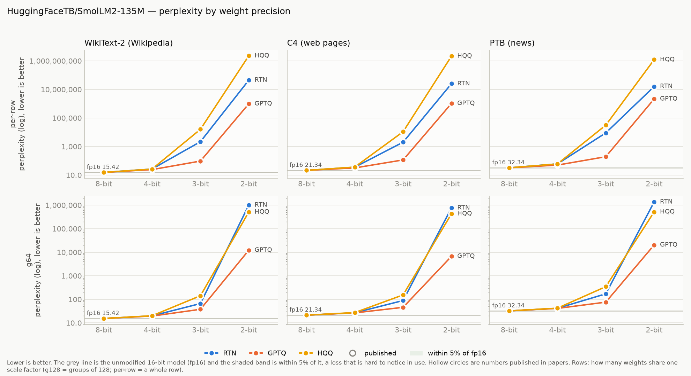
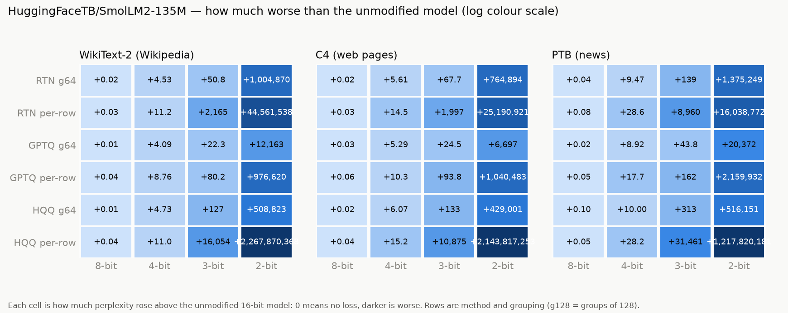

# smollm2-135m

Model: `HuggingFaceTB/SmolLM2-135M` · generated by `ptq aggregate` from `results/raw/runs/` — do not edit by hand.

**How to read this page.** Perplexity measures how surprised the model is by real text:
lower is better. The *full precision* number is the unmodified model (16-bit weights).
Every other number is the same model after its weights were squeezed to fewer bits;
the percentage says how much worse it got. Under ~5% is barely noticeable, over 2× is
badly damaged. See `results/README.md` for the method and grouping terms.

## Full precision (the baseline)

| dataset | perplexity |
|---|---|
| WikiText-2 (Wikipedia articles) | 15.4154 |
| C4 (web pages) | 21.3447 |
| PTB (1980s news sentences) | 32.3352 |

## Best result at each bit width, on WikiText-2 (Wikipedia articles)

| bits | best method | grouping | perplexity | vs full precision |
|---|---|---|---|---|
| 8 | HQQ | groups of 64 | 15.4258 | +0.1% |
| 4 | GPTQ | groups of 64 | 19.5012 | +26.5% |
| 3 | GPTQ | groups of 64 | 37.7635 | 2.4× worse |
| 2 | GPTQ | groups of 64 | 12,178.11 | 790× worse |

## Charts

## Every result: WikiText-2 (Wikipedia articles)

Full precision: 15.4154

| method | grouping | 8-bit | 4-bit | 3-bit | 2-bit |
|---|---|---|---|---|---|
| GPTQ | per row | 15.4519 (+0.2%) | 24.1774 (+56.8%) | 95.6368 (6.2× worse) | 976,635.13 (63,355× worse) |
| GPTQ | groups of 64 | 15.4266 (+0.1%) | 19.5012 (+26.5%) | 37.7635 (2.4× worse) | 12,178.11 (790× worse) |
| HQQ | per row | 15.4581 (+0.3%) | 26.4553 (+71.6%) | 16,069.75 (1,042× worse) | 2,267,870,383.71 (147,117,545× worse) |
| HQQ | groups of 64 | 15.4258 (+0.1%) | 20.1503 (+30.7%) | 142.16 (9.2× worse) | 508,838.64 (33,009× worse) |
| RTN (plain rounding) | per row | 15.4465 (+0.2%) | 26.6056 (+72.6%) | 2,180.35 (141× worse) | 44,561,553.62 (2,890,724× worse) |
| RTN (plain rounding) | groups of 64 | 15.4307 (+0.1%) | 19.9461 (+29.4%) | 66.2409 (4.3× worse) | 1,004,885.40 (65,187× worse) |

## Every result: C4 (web pages)

Full precision: 21.3447

| method | grouping | 8-bit | 4-bit | 3-bit | 2-bit |
|---|---|---|---|---|---|
| GPTQ | per row | 21.4008 (+0.3%) | 31.6852 (+48.4%) | 115.18 (5.4× worse) | 1,040,504.16 (48,748× worse) |
| GPTQ | groups of 64 | 21.3764 (+0.1%) | 26.6378 (+24.8%) | 45.8524 (2.1× worse) | 6,718.36 (315× worse) |
| HQQ | per row | 21.3875 (+0.2%) | 36.5812 (+71.4%) | 10,896.77 (511× worse) | 2,143,817,274.83 (100,437,743× worse) |
| HQQ | groups of 64 | 21.3657 (+0.1%) | 27.4114 (+28.4%) | 154.43 (7.2× worse) | 429,022.37 (20,100× worse) |
| RTN (plain rounding) | per row | 21.3794 (+0.2%) | 35.8808 (+68.1%) | 2,018.68 (95× worse) | 25,190,942.26 (1,180,195× worse) |
| RTN (plain rounding) | groups of 64 | 21.3686 (+0.1%) | 26.9501 (+26.3%) | 89.0504 (4.2× worse) | 764,915.13 (35,836× worse) |

## Every result: PTB (1980s news sentences)

Full precision: 32.3352

| method | grouping | 8-bit | 4-bit | 3-bit | 2-bit |
|---|---|---|---|---|---|
| GPTQ | per row | 32.3802 (+0.1%) | 50.0339 (+54.7%) | 193.96 (6.0× worse) | 2,159,964.39 (66,799× worse) |
| GPTQ | groups of 64 | 32.3597 (+0.1%) | 41.2585 (+27.6%) | 76.0980 (2.4× worse) | 20,404.04 (631× worse) |
| HQQ | per row | 32.3808 (+0.1%) | 60.5571 (+87.3%) | 31,493.12 (974× worse) | 1,217,820,212.97 (37,662,376× worse) |
| HQQ | groups of 64 | 32.4334 (+0.3%) | 42.3312 (+30.9%) | 345.20 (11× worse) | 516,183.58 (15,964× worse) |
| RTN (plain rounding) | per row | 32.4159 (+0.2%) | 60.9210 (+88.4%) | 8,992.77 (278× worse) | 16,038,804.47 (496,017× worse) |
| RTN (plain rounding) | groups of 64 | 32.3758 (+0.1%) | 41.8092 (+29.3%) | 171.26 (5.3× worse) | 1,375,281.41 (42,532× worse) |

## Runs that did not produce a number

42 configuration(s) were skipped or failed. Reasons:

- `group_size_indivisible:128:[576, 1536]` (42)

